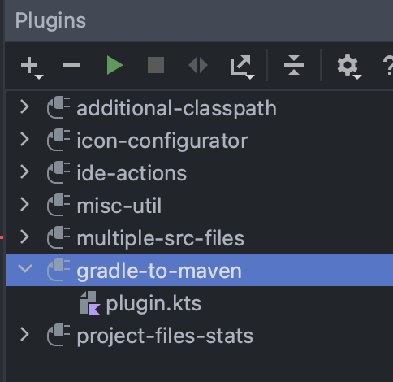

# IntelliJ LivePlugin - Gradle dep to Maven dep translator

__Problem__: I sometimes need to copy dependencies from Gradle projects quickly to a Maven project. 

__Solution__: The Kotlin script `plugin.kts` contains a [LivePlugin](TODO) for conveniently performing a copy of for example: 

```
dependencies {
    testImplementation 'junit:junit:4.13'
    compileOnly 'org.apache.httpcomponents:httpclient:4.5.5'
    implementation 'org.apache.tomcat.embed:tomcat-embed-jasper:9.0.2'
}
```

to a target Maven pom.xml: 

```
...
    <dependency>
      <groupId>junit</groupId>
      <artifactId>junit</artifactId>
      <scope>test</scope>
    </dependency>
    <dependency>
      <groupId>org.apache.httpcomponents</groupId>
      <artifactId>httpclient</artifactId>
      <scope>compile</scope>
    </dependency>
    <dependency>
      <groupId>org.apache.tomcat.embed</groupId>
      <artifactId>tomcat-embed-core</artifactId>
      <scope>runtime</scope>
    </dependency>
...
```

## Installation
To install the `plugin.kts` firstly install LivePlugin from the marketplace to IntelliJ for example: 


Note: Replace the plugin.kts with the included `plugin.kts`.

## Suggested improvements

- [] Format maven dependencies on paste

Enjoy :sparkles:

---
Author: Mark Hesketh
  Date: 12/01/23